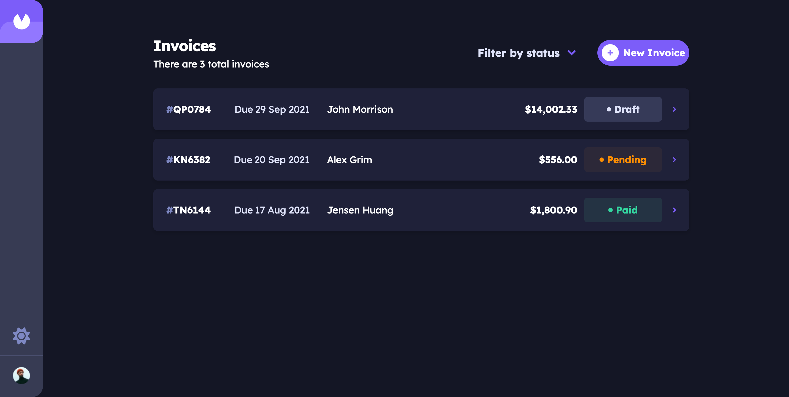

# 📑 Invoice App

A full-stack invoicing app: create, edit, and track invoices from draft through pending to paid. Built as a personal showcase of: a [bulletproof-react](https://github.com/alan2207/bulletproof-react) frontend and a small, idiomatic Go backend, wired together with real authentication and tested end to end.

**Try the app live**: [invoice-app-tyrell-curry.vercel.app](https://invoice-app-tyrell-curry.vercel.app)

[Frontend README](./frontend/README.md)
|
[Backend README](./backend/README.md)



## 🥧 Deployment

The frontend is on Vercel. The API and its database run on a **Raspberry Pi 5** in my home, reachable at [invoices-api.tyrellcurry.io](https://invoices-api.tyrellcurry.io) behind [Caddy](https://caddyserver.com), which handles TLS automatically. Code ships by merging into `main` (day-to-day work happens on `develop`; a PR from `develop` into `main` is a release), then a GitHub Actions workflow cross-compiles the Go binary for `linux/arm64`, it then joins the Pi's Tailscale network, and deploys it over SSH. No cloud compute involved on the backend side at all.

Google sign-in is backed by that same Postgres instance, not just a token the frontend trusts blindly. The backend exchanges Google's auth code, verifies the ID token, and upserts a `users` row keyed by the account's stable Google subject ID. Signing in issues a session, also a Postgres row, whose bearer token the frontend holds; a guest ("continue without an account") gets the identical session mechanism, just without a user attached. Every invoice query is scoped to that session's owner at the SQL layer, so a guest and a Google account can never see each other's data, and signing in with Google on a second device picks up the same invoices because they're tied to the account, not the browser.

Full detail on the Pi setup (systemd unit, Postgres in Docker, the deploy workflow) is in the [backend README](./backend/README.md#deployment) and [`backend/deploy/`](./backend/deploy/).

## 👾 Architecture

- **Frontend**: React 19, TypeScript, Tailwind 4, react-router. Feature-sliced per bulletproof-react, with a small shared UI kit documented in Storybook. Every user-facing string runs through `use-intl`, so the app is internationalized end to end, not just English hardcoded with a translation function wrapped around it.
- **Backend**: Go, stdlib `net/http` only (no framework), Postgres via `pgx`, package-by-feature (`internal/invoice`, `internal/auth`), embedded SQL migrations.
- **Auth**: Google OAuth alongside an ephemeral guest mode, unified under one session model in Postgres, see [Deployment](#deployment) above for how that actually works.
- **Testing**: Go unit and Postgres-backed integration tests, Vitest unit and snapshot tests on the frontend, and a Playwright suite that drives the real UI against the real API and a real database, not mocks.
- **CI**: GitHub Actions, path-filtered so a frontend-only change doesn't spin up the Go job and vice versa.

Two independent halves in one repo: `backend/` is a Go module, `frontend/` is a plain Vite/npm project. They're joined only by `go.work` (for the Go workspace) and a shared domain shape at the API boundary, no monorepo tooling.

## 💻 Local development

**Prerequisites**: Node 24, Go 1.26+, Docker (for Postgres).

```bash
git clone https://github.com/tyrellcurry/invoiceApp.git
cd invoiceApp
```

**1. Start Postgres and the backend**

```bash
cd backend
cp .env.example .env
docker compose up -d db
go run .
```

`go run .` applies migrations on startup and seeds nothing globally: each account gets its own 3 example invoices the first time it's created. See the [backend README](./backend/README.md) for what's in `.env` and why.

**2. Start the frontend**

```bash
cd frontend
npm install
npm run dev
```

Open `http://localhost:5173`. Guest mode works immediately with no further setup; Google sign-in needs a real OAuth client (see the backend README).

## Testing

```bash
# Backend, from backend/
go test ./...                      # unit, no database needed
go test -tags=integration ./...    # integration, needs db running

# Frontend, from frontend/
npm test                           # unit + snapshot
npm run test:e2e                   # Playwright, starts both servers itself
npm run storybook                  # component catalog
```

Full details, including how each suite is structured, live in the [backend](./backend/README.md) and [frontend](./frontend/README.md) READMEs.
